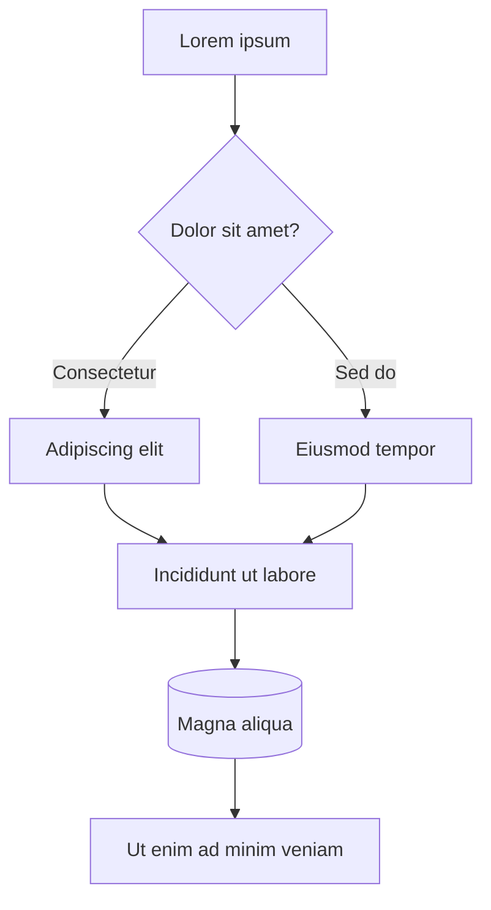

[Sommaire](Readme.md) · [Chapitre suivant →](02-Exemple%20de%20cours%20en%20multi-fichier.md)

# Template de cours : exemple de cours mono fichier

## 🎯 Objectifs pédagogiques

À la fin de ce cours, vous saurez :

1. Écrire un cours mono fichier efficient.
2. Comprendre les parties importantes à y mettre
3. Lorem ipsum dolor sit amet, non deserunt sunt elit fugiat non veniam do proident commodo
4. Lorem ipsum dolor sit amet, in nostrud eu nulla eiusmod elit minim.
5. Lorem ipsum dolor sit amet, adipisicing aliqua nisi irure labore cupidatat magna nostrud velit ut ipsum nostrud excepteur duis magna exercitation excepteur duis.

## ❔ Pourquoi ce cours sur XXXX ?

Dans cette section optionnelle, on peut ancrer le cours dans un corpus global pour réaffirmer son bienfondé.

## Sommaire

Un sommaire optionnel peut être fait mais dans la mesure où le cours tient sur un seul document il n'est pas forcément nécessaire.

---

## 1. Les schémas

Autant que faire se peut, il est attendu que les schémas soient effectués en [Mermaid](https://mermaid.js.org/)



---

## 2. Les images

Pour les images, soit vous utilisez des images déjà publiques sur des CDN pérennes, soit (c'est préférable) vous créez un dossier `assets`, vous y mettez vos images et vous les référencez ainsi : 

```markdown

```

Ce qui donne : 

Si vous voulez centrer l'image, utilisez la balise `<center>` comme suit (notez les lignes vides avant et après le tag d'image) :

```markdown
<center>


</center>
```

Ce qui donne : 

<center>


</center>

---

## 3. Le code

Il est préférable, afin de bénéficier de la coloration syntaxique, de spécifier le langage dans vos snippets de code : ` ```javascript `

```javascript
// exemple de javascript
console.log('Je suis coloré !');
```

```yaml
# exemple de yaml

Services:
    Lorem:
        ipsum: dolor
```

---

## 4. Séparation des parties

Une bonne pratique est d'insérer une ligne horizontale en utilisant `---` sur une ligne isolée

---

## 5. Parties escamotables

Lorsqu'un exercice est donné et que la correction ne doit pas être montrée immédiatement, vous pouvez utiliser la syntaxe suivante : 

```markdown
<details>
<summary>Voir la correction</summary>

1. réponse
2. réponse 2
3. réponse 3

</details>
```

Ce qui donnera ceci : 

<details>
<summary>Voir la correction</summary>

1. réponse
2. réponse 2
3. réponse 3

</details>

---

## ANNEXE A - Lorem Ipsum

En annexe, vous pouvez insérer : 

- des ressources pédagogiques supplémentaires
- des références académiques
- des liens vers des ressources outils ou docs en ligne
- ...

---

## Pour aller plus loin

Ce cours tient dans un seul fichier. Dès qu'il s'allonge, le découpage en
chapitres devient préférable : un fichier par chapitre, recollés automatiquement
à la génération du support.

---

[Sommaire](Readme.md) · [Chapitre suivant →](02-Exemple%20de%20cours%20en%20multi-fichier.md)
