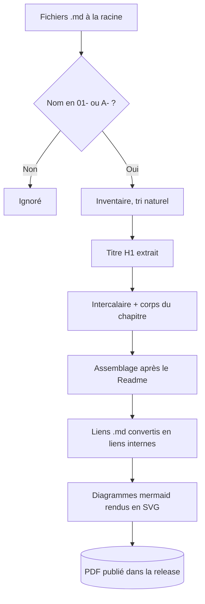

[← Chapitre précédent](01-Exemple%20de%20cours%20en%20un%20seul%20fichier.md) · [Sommaire](Readme.md) · [Chapitre suivant →](03-Slides.md)

# Organiser un cours en plusieurs fichiers

Un cours court tient dans un seul fichier. Passé quelques dizaines de pages, il
devient pénible à relire, à corriger à plusieurs et à parcourir sur GitHub. La
solution est de le découper en chapitres : un fichier par chapitre, à la racine
du dépôt. Le workflow `Documents` les recolle en un seul PDF, dans l'ordre, sans
qu'aucun sommaire n'ait à être maintenu à la main.

## Ce qui fait un chapitre

Trois conditions, toutes vérifiées par le workflow :

1. le fichier est **à la racine** du dépôt ;
2. son nom commence par un **numéro** (`01-`, `1-`) ou par une **lettre**
   (`A-`, `B-`), suivi d'un séparateur : tiret, point, souligné ou espace ;
3. ce n'est pas le Readme.

Tout le reste est ignoré. `Readme.md` ouvre le document, `slides.md` alimente
les diapositives, et les fichiers rangés dans des sous-dossiers ne sont jamais
repris — c'est là qu'on met les brouillons, les corrigés et les ressources.

Le séparateur porte à lui seul la distinction entre un chapitre et un fichier
ordinaire. Revers de la médaille : un `a-propos.md` posé à la racine serait pris
pour le chapitre « a ». La liste retenue est journalisée au début de chaque run,
sous « Chapitres : » — c'est le premier endroit à regarder si le PDF contient
autre chose que ce qu'on croyait.

## L'ordre des chapitres

L'ordre est celui des noms de fichiers, trié en version naturelle : `10-` vient
après `9-`, et non avant comme le voudrait l'ordre alphabétique. Les numéros
passent avant les lettres si les deux conventions cohabitent, ce qui permet de
réserver les lettres aux annexes.

```
Readme.md                       ← page d'ouverture du support
01-installation.md              ← chapitre 1
02-premieres-requetes.md        ← chapitre 2
10-agregations.md               ← chapitre 3, et non avant le 02
A-glossaire.md                  ← annexe, après tous les numéros
slides.md                       ← diapositives, hors du support
ressources/                     ← ignoré par le workflow
  exercices.md
  corriges.md
```

Numéroter de dix en dix (`10-`, `20-`, `30-`) laisse la place d'insérer un
chapitre sans renommer les suivants — et sans casser les liens qui pointent
vers eux.

## Le titre de niveau 1 et l'intercalaire

Chaque chapitre doit s'ouvrir sur un titre de niveau 1. Ce titre ne s'imprime
pas tel quel : il est reporté sur une page d'intercalaire pleine page, qui
sépare le chapitre du précédent dans le PDF.

Conséquence directe, **tout ce qui précède ce titre disparaît du support**. La
ligne de navigation en tête de ce fichier — celle qui renvoie au chapitre
précédent et au sommaire — n'existe que pour la lecture sur GitHub. Elle est
utile là où le lecteur navigue de fichier en fichier, elle n'a aucun sens dans
un document relié, et elle est retirée à l'assemblage. Une ligne équivalente
placée en bas de fichier, elle, serait conservée : la navigation se met avant le
titre, jamais après.

Un chapitre sans titre de niveau 1 reste publié, mais l'intercalaire porte alors
le nom du fichier. C'est un filet de sécurité, pas une manière de faire.

## Les liens entre chapitres

Un lien Markdown ordinaire vers un fichier voisin — cible `10-agregations.md`,
libellé libre — fonctionne des deux côtés : GitHub l'ouvre comme un lien de
fichier, et le workflow le réécrit en lien interne vers l'intercalaire du
chapitre visé, cliquable dans le PDF. Le lien vers le chapitre précédent en fin
de page en est un exemple réel.

Quatre points à connaître :

- Le nom de fichier doit être **encodé** s'il contient des espaces (`%20`) :
  un lien dont la cible contient une espace n'est pas reconnu.
- Le **fragment est abandonné** : un lien vers une ancre de section atterrit sur
  l'intercalaire du chapitre, seule ancre garantie dans le PDF.
- Un lien vers un fichier **absent du support** — un corrigé rangé dans un
  sous-dossier, par exemple — est retiré : il ne reste que son libellé, en texte
  simple. Le nombre de liens convertis et retirés est journalisé.
- Après réécriture, plus aucune cible en `.md` ne doit subsister, **y compris
  dans un bloc de code** : le garde-fou lit le document entier, et un exemple de
  lien montré dans une clôture ferait échouer la construction. C'est la raison
  pour laquelle cette section décrit la syntaxe au lieu de l'illustrer.

## Le chemin d'un chapitre jusqu'au PDF



## Deux pièges de fin

**Les images.** Aucune étape ne recopie les fichiers du dépôt dans le dossier de
construction : une image désignée par un chemin relatif ne sera pas trouvée au
moment du rendu. Les illustrations se référencent par URL absolue, comme le logo
de la page de garde.

**Le déclenchement.** Les documents ne sont produits que sur un tag `v*`. Pour
vérifier le rendu d'un découpage sans consommer un numéro de version, lancer le
workflow à la main : il produit l'artefact sans créer de release.

---

[← Chapitre précédent](01-Exemple%20de%20cours%20en%20un%20seul%20fichier.md) · [Sommaire](Readme.md) · [Chapitre suivant →](03-Slides.md)
